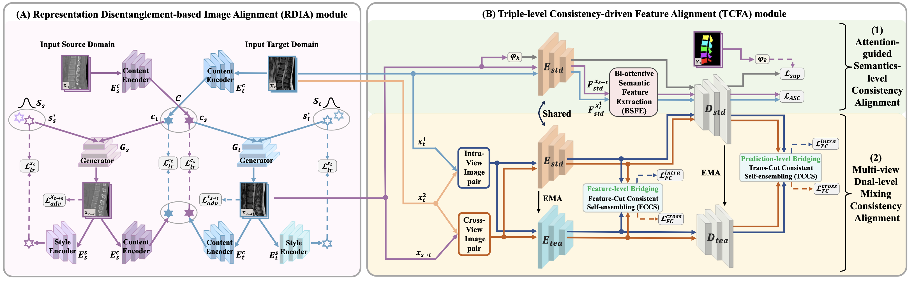

# ReTri: Progressive Domain Bridging via Representation Disentanglement and Triple-level Consistency-driven Feature Alignment

[](https://www.python.org/downloads/)
[](https://pytorch.org/)
[](https://creativecommons.org/licenses/by-nc-sa/4.0/)

**Official PyTorch implementation of "ReTri: Progressive Domain Bridging via Representation Disentanglement and Triple-level Consistency-driven Feature Alignment for Unsupervised Domain Adaptive Medical Image Segmentation"**

*Submitted to Neural Networks Journal*

## 📋 Table of Contents

- [Overview](#overview)
- [Key Features](#key-features)
- [Methodology](#methodology)
- [Installation](#installation)
- [Dataset Preparation](#dataset-preparation)
- [Training](#training)
- [Testing](#testing)
- [Results](#results)
- [Citation](#citation)
- [License](#license)
- [Contact](#contact)
- [Updates](#updates)

## 🔍 Overview

ReTri is a novel end-to-end progressive domain bridging framework designed specifically for unsupervised domain adaptation (UDA) in medical image segmentation. The method addresses three critical challenges in UDA-based segmentation:

1. **Model Bias Problem**: The inherent domain gap between synthetic and real target images persists, causing segmentation models to exhibit bias towards synthetic data
2. **Suboptimal Knowledge Transfer**: Direct knowledge transfer between synthetic and real target domains remains challenging due to substantial distribution shifts
3. **Intra-domain Variation Overlook**: Most existing methods focus on inter-domain alignment while overlooking rich intra-domain variations within the target domain

ReTri synergistically integrates two modules:
- **Representation Disentanglement-based Image Alignment (RDIA)**: Establishes an initial domain bridge by decoupling and aligning fundamental visual disparities
- **Triple-level Consistency-driven Feature Alignment (TCFA)**: Hierarchically bridges remaining cross-domain discrepancies through novel consistency-driven alignment mechanisms

### 🏗️ Framework Overview

<div align="center">
  
  <p><strong>Figure 1:</strong> Overall architecture of ReTri framework. The framework consists of two main modules: (1) Representation Disentanglement-based Image Alignment (RDIA) for initial visual disparity alignment, and (2) Triple-level Consistency-driven Feature Alignment (TCFA) for systematic domain discrepancy minimization.</p>
</div>


## ✨ Key Features

- 🎯**TCFA**: Our method introduces two novel mechanisms that operate across three levels (semantics, feature, and prediction) and two views (intra-view/intra-domain and interview/inter-domain) to address distinct challenges that we have summarized in the research gap paragraph. The attention-guided semantic-level consistency alignment mechanism aims to alleviating the model bias problem at the semantic level while the multi-view dual-level mixing consistency alignment mechanism aims to minimize both inter- and intra-domain shift by constructing intermediate domain bridges at both the feature and prediction levels. 
- 📊 **Comprehensive Evaluation**: Tested on four challenging medical datasets across seven UDA scenarios
- 📈 **Superior Performance**: Consistent improvements over state-of-the-art methods across all evaluated scenarios

## 🧠 Methodology

### Architecture Overview

ReTri comprises two synergistic modules that progressively bridge domain gaps:

1. **Representation Disentanglement-based Image Alignment (RDIA) Module**
   - Establishes an initial domain bridge by addressing fundamental visual disparities
   - Decouples and aligns visual disparities while preserving anatomical structures
   - Provides pixel-level image alignment foundation for complex visual domain gaps

2. **Triple-level Consistency-driven Feature Alignment (TCFA) Module**
   - Systematically minimizes remaining semantic and distributional discrepancies
   - Features two novel alignment mechanisms:
     - **Attention-guided Semantics-level Consistency Alignment**
       - Bi-attentive Semantic Feature Extraction (BSFE) component
       - Attention-adaptive Semantic Consistency (ASC) loss function
       - Dynamic alignment of high-level semantic representations
     - **Multi-view Dual-level Mixing Consistency Alignment**
       - Feature-Cut consistent self-ensembling (FCCS) component
       - Trans-Cut consistent self-ensembling (TCCS) component
       - Complementary feature- and prediction-level consistency regularization

### Training Strategy

```
Phase 1: Warm up
├── RDIA module training
├── Visual disparity alignment
└── Initial domain bridge establishment

Phase 2: Joint Training
├── Joint RDIA + TCFA training
├── Attention-guided semantic alignment
├── Multi-view dual-level mixing consistency alignment
└── Progressive domain bridging
```

## 🚀 Installation

### Prerequisites

- Python 3.7+
- PyTorch 1.8+
- CUDA 10.2+ (recommended)

### Dependencies

```bash
pip install torch torchvision torchaudio
pip install numpy scipy matplotlib
pip install opencv-python pillow
pip install scikit-learn scikit-image
pip install medpy nibabel
pip install kornia
pip install swanlab
pip install pyyaml tqdm
```

### Clone Repository

```bash
git clone https://github.com/xiaorugao999/ReTri
cd ReTri
```

## 📁 Dataset Preparation

### Dataset Structure

The code expects the following directory structure:

```
datasets/Prostate_RUN2BMC/
├── train_RUN_source_30/          # Source domain training data
│   ├── Case00/
│   │   ├── Case00_slice01_all14.png
│   │   ├── Case00_slice01_all14_segmentation.png
│   │   └── ...
│   └── ...
├── train_BMC_target_20/          # Target domain training data
│   ├── Case00/
│   │   ├── Case00_slice01_all14.png
│   │   ├── Case00_slice01_all14_segmentation.png
│   │   └── ...
│   └── ...
├── test_BMC_target_10/           # Target domain test data
└── test_external_*/              # External validation data
```
**🔗 Baidu Cloud Download Link**: [Download Datasets](https://pan.baidu.com/s/12P7Yyk6ymW438BJvFhEEJQ?pwd=7vxf)

### Data Format

- **Images**: PNG format, grayscale or RGB
- **Masks**: PNG format with segmentation labels
- **Naming Convention**: `{CaseID}_slice{XX}_all{XX}.png` and `{CaseID}_slice{XX}_all{XX}_segmentation.png`

## 🏋️ Training

### Configuration

Modify the configuration file `configs/config_Prostate1_RUN2BMC_Ours.yaml`:

```yaml
# Dataset settings
data_root: './datasets/Prostate_RUN2BMC'
train_A_dir: 'train_RUN_source_30'
train_B_dir: 'train_BMC_target_20'
test_A_dir: 'test_RUN_source'
test_B_dir: 'test_BMC_target_10'

# Training parameters
batch_size: 1
max_iter: 31000
pre_train_before_seg: 1000
validate_iter: 100

# Model settings
seg:
  n_classes: 2
  input_nc: 1
  output_nc: 2
```

### Start Training

```bash
# Basic training
python train_Prostate_RUN2BMC_Ours.py \
    --config configs/config_Prostate1_RUN2BMC_Ours.yaml \
    --output_path ./outputs \
    --trainer trainer_ReTri \
    --save_name Prostate_RUN2BMC_ReTri

# Resume training
python train_Prostate_RUN2BMC_Ours.py \
    --config configs/config_Prostate1_RUN2BMC_Ours.yaml \
    --output_path ./outputs \
    --trainer trainer_ReTri \
    --save_name Prostate_RUN2BMC_ReTri \
    --resume_munit True \
    --resume_dir ./checkpoints
```

## 🧪 Testing

### Model Evaluation

```bash
# Test trained model
python test_Prostate_RUN2BMC_Ours.py \
    --config configs/config_Prostate1_RUN2BMC_Ours.yaml \
    --output_path ./outputs \
    --trainer trainer_ReTri \
    --save_name Prostate_RUN2BMC_ReTri \
    --resume_dir ./checkpoints \
    --test_model_name test_Prostate_RUN2BMC_ReTri
```

### Evaluation Metrics

- **Dice Coefficient**: 3D volume-based evaluation
- **Average Symmetric Surface Distance (ASSD)**: Surface distance metric

## 📊 Results

### Comprehensive Evaluation

ReTri has been extensively evaluated on **four challenging medical datasets** across **seven UDA-based segmentation scenarios** and **two external validation scenarios**:

#### Dataset Coverage
- **Lumbar Spine CT-MR**: Cross-modality adaptation
- **Cardiac CT-MR**: Bidirectional cross-modality segmentation  
- **Cross-center cross vendor Echocardiography**: CAMUS ↔ EchoNet-Dynamic
- **Multi-center cross-vendor Prostate MR**: Multi-center prostate segmentation

#### Performance Improvements

| Dataset | Scenario | DSC Improvement | Method |
|---------|----------|-----------------|---------|
| Spine | CT→MR | **+2.9%** | ReTri vs SOTA |
| Cardiac | CT→MR | **+3.6%** | ReTri vs SOTA |
| Cardiac | MR→CT | **+2.4%** | ReTri vs SOTA |
| Echo | CAMUS→EchoNet | **+1.7%** | ReTri vs SOTA |
| Echo | EchoNet→CAMUS | **+2.3%** | ReTri vs SOTA |
| Prostate | Multi-center A→B | **+12.2%** | ReTri vs SOTA |
| Prostate | Multi-center B→A | **+12.0%** | ReTri vs SOTA |

## 📚 Citation
**Status**: 📝 Under Review

We appreciate your interest in our work! If you use this code in your research, please consider:
- ⭐ Starring this repository
- 📧 Contacting us for collaboration opportunities
- 🔄 Following updates on publication status

**Hope we can get published!** 🎉


## 📄 License

This project is licensed under the Creative Commons Attribution-NonCommercial-ShareAlike 4.0 International License (CC BY-NC-SA 4.0).

See the [LICENSE](LICENSE) file for details.

## 📞 Contact

For questions, suggestions, or collaboration opportunities, please contact:

- **Email**: xiaoru.gao@sjtu.edu.cn
- **GitHub Issues**: [Create an issue](https://github.com/xiaorugao999/ReTri/issues)
- **Research Group**: https://citi-imr.sjtu.edu.cn

We welcome contributions and feedback from the community!

## 🔄 Updates

### Version History

- **v1.0.0** (Current): Initial release with ReTri implementation
  - Complete training and testing pipeline
  - Comprehensive evaluation metrics
  - SwanLab integration for experiment tracking

### Planned Updates

- 🔮 **Extended Dataset Support**: Implementation for Lumbar Spine CT-MR, Cardiac CT-MR, and Cross-domain Echocardiography datasets
- 🔮 **Pre-trained Models**: Release of pre-trained weights for all seven UDA scenarios


**⚠️ Important Notes:**

- This code is provided for research purposes only
- Please ensure compliance with data usage agreements
- Medical AI applications require appropriate validation and regulatory approval

**🔄 We are continuously updating this repository with improvements and new features. Please check back regularly for updates!**

---
